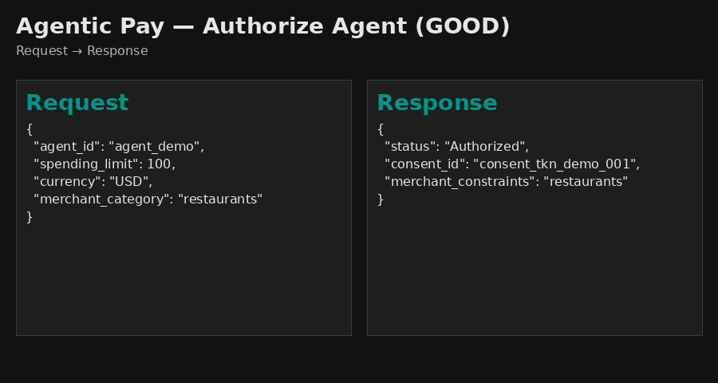

# Open Finance Prototypes

A FastAPI-based prototype gateway showcasing how new APIs for Agentic Pay authorization and ESG Carbon Impact enrichment.

<div style="padding: 15px; border: 1px solid #d1242f; border-left: 5px solid #d1242f; background-color: #fff5f5; border-radius: 6px;">
<strong>Important:</strong> This repository contains sample code and theoretical APIs for demonstration purposes only. All data, logic, and responses are synthetic and do not reflect production systems or live services.
</div>

## Overview

This project demonstrates two core API capabilities:

1. **Agentic Pay** - Secure auth  orization for AI agents with spending guardrails and category restrictions.
2. **Carbon Impact** - ESG transaction enrichment with carbon footprint calculations.

## Market Context

This prototype explores future possibilities for open finance strategy, combining AI agent governance with ESG transparency through:

- **Secure spend controls for autonomous agents** - Implements guardrails like spending limits and prohibited merchant categories to ensure responsible AI commerce.
- **Real-time carbon impact enrichment** - Provides immediate environmental feedback on transactions, enabling sustainability tracking and reporting.
- **Open API gateway pattern** - Demonstrates scalable service composition for future open finance capabilities.

The project bridges the intersection of responsible AI commerce and sustainability reporting—addressing an emerging market need for trustworthy, transparent agent-based financial systems.

## Project Structure

```
.
├── main.py              # Standalone authorization API 
├── gateway.py           # FastAPI gateway routing to all APIs
├── requirements.txt     # Python dependencies
├── README.md            # This file
└── apis/
    ├── agent_pay.py     # Agentic Pay authorization endpoint
    └── carbon_impact.py # Carbon Impact enrichment endpoint
```

## Product Vision

### Why 

Consumers and businesses are moving from manual finance to **agent‑assisted and autonomous finance**. Trust will be earned by two capabilities: 

1. Strong AI spend governance so agents can act safely on the consumers behalf.
2. Transparent impact signals so every payment can be enriched with ESG context. 

This prototype demonstrates the ability to provide both in one open, composable experience.

### What (Two Core Capabilities)

1. **Agentic Pay (Authorization & Guardrails)**
A policy and authorization surface for AI agents that issues time‑bound, scope‑limited consent tokens after policy checks (e.g., amount ceilings, merchant category restrictions). It’s purpose‑built for “human‑in‑the‑loop” controls and step‑up auth when risk increases.

2. **Carbon Impact (ESG Enrichment)**
A real‑time enrichment service that estimates transactional carbon footprint using signals like MCC and amount, returning clear, explainable impact metrics to wallets, PFMs, SMB dashboards and enterprise reporting.

### How (Gateway Pattern)

A **gateway‑first architecture** composes these services into a single, consistent developer and policy surface. The prototype uses a FastAPI gateway for local iteration, mapping directly to our enterprise API Gateway principles for routing, security enforcement, rate limiting, and observability as we move toward staged environments.

## Demo

The demo shows live enforcement of spend ceilings, category restrictions, and CO₂ scoring. The demo aims to show how APIs can govern agentic transactions and enrich them in real time.



## Setup & Installation

### Prerequisites
- Python 3.8+
- pip

### Installation

1. Clone the repository:
```bash
git clone <repository-url>
cd open-finance-prototypes
```

2. Install dependencies:
```bash
pip install -r requirements.txt
```

### Running the API Gateway

Start the FastAPI server:
```bash
uvicorn gateway:app --reload --port 8000
```

The API will be available at:
- **Local development (on your machine):** `http://localhost:8000`
- **GitHub Codespace:** Use the forwarded URL shown in the port tab (e.g., `https://your-codespace-url.app.github.dev`)

View interactive API documentation:
- **Swagger UI:** `/docs` 
- **ReDoc:** `/redoc` (alternative documentation format)

## API Endpoints

### Agentic Pay Authorization

**Endpoint:** `POST /agent/authorize-agent`

Authorizes AI agents for spending with security guardrails including spending limits and merchant category restrictions.

**Request Body:**
```json
{
  "agent_id": "agent_123",
  "spending_limit": 250.00,
  "currency": "USD",
  "merchant_category": "restaurants"
}
```

**Success Response (200):**
```json
{
  "status": "Authorized",
  "consent_id": "consent_tkn_2026_x99",
  "merchant_constraints": "restaurants",
  "message": "AI Agent authorized within defined guardrails."
}
```

**Error Responses:**

- **Spending Limit Exceeded (403):** Transactions over $500 require MFA step-up.
- **High-Risk Category (403):** Prohibited categories include gambling, casino, betting, crypto.

**Example Request:**
```bash
curl -X POST "http://localhost:8000/agent/authorize-agent" \
  -H "Content-Type: application/json" \
  -d '{
    "agent_id": "agent_xyz",
    "spending_limit": 100,
    "currency": "USD",
    "merchant_category": "restaurants"
  }'
```

### Carbon Impact Enrichment

**Endpoint:** `POST /carbon/enrich-transaction`

Enriches transactions with carbon footprint data based on Merchant Category Code (MCC).

**Request Body:**
```json
{
  "mcc": "5411",
  "amount": 50.00,
  "description": "Weekly grocery shopping at Whole Foods"
}
```

**Response (200):**
```json
{
  "original_transaction": "Weekly grocery shopping at Whole Foods",
  "merchant_category": "Grocery Stores",
  "carbon_footprint_kg": 6.0,
  "insights": "This purchase contributed 6.0kg of CO2 to your monthly limit."
}
```

**Supported MCCs:**
- `4511` - Airlines (0.85 kg CO2/$)
- `5411` - Grocery Stores (0.12 kg CO2/$)
- `5541` - Gas Stations (2.10 kg CO2/$)
- `5812` - Restaurants (0.25 kg CO2/$)
- Default for unlisted MCCs: 0.15 kg CO2/$

**Example Request:**
```bash
curl -X POST "http://localhost:8000/carbon/enrich-transaction" \
  -H "Content-Type: application/json" \
  -d '{
    "mcc": "4511",
    "amount": 250.00,
    "description": "Flight to New York"
  }'
```

## Architecture

### Gateway Pattern

The `gateway.py` file implements an API gateway pattern that:
- Aggregates multiple API services
- Provides unified routing with path prefixes
- Tags endpoints for logical grouping
- Exposes OpenAPI documentation

### Routers

Each API module exports a FastAPI `APIRouter` that is included in the main gateway:

```python
from fastapi import FastAPI
from apis.agent_pay import router as agent_router
from apis.carbon_impact import router as carbon_router

app = FastAPI()
app.include_router(agent_router, prefix="/agent", tags=["Agentic Pay"])
app.include_router(carbon_router, prefix="/carbon", tags=["ESG Enrichment"])
```

## Technology Stack

- **FastAPI** - High-performance Python web framework
- **Uvicorn** - ASGI web server
- **Pydantic** - Data validation using Python type hints
- **PyJWT** - JWT token handling (for future auth enhancements)

## Future Enhancements

- JWT-based API authentication
- Add OAuth2 or API Key headers via `Security` dependencies
- Request logging and audit trails
- Real-time carbon factor updates from ESG partners
- Transaction batch processing
- Rate limiting and throttling
- Database persistence for transactions
- Webhook support for real-time notifications